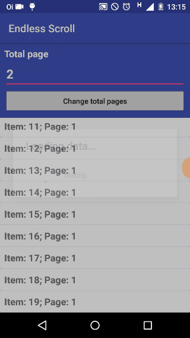

# Android Endless Scroll

This project is a EndlessScroll for using on RecyclerView

Execute the sample in app folder

## Preview

*The ProgressDialog is optional.


## Usage

* Configure the RecyclerView with the Adapter and LayoutManager before use the ScrollEndeless
```java
recyclerView.setAdapter(adapter);
recyclerView.setLayoutManager(layoutManager);
```
* Declare ScrollEndless like this
```java
endless = new ScrollEndless(mContext, recyclerView, layoutManager);
```

* Set the total page. Default is 1
The total pages value you can get it from your response, setting in a global variable.
```java
endless.setTotalPage(total);
```
                
* This is importante. Make your requestCall before get the EndlessListener. For popule the adapter.
```java
yourRequestCall();
```
* Get the ScrollEndless listener. 

For call the next page when is available
``` java
onLoadMore() ``` 

All pages are load. Last page is called
```java onLoadAllFinish() ``` 


```java
endless.addScrollEndless(new EndlessListener() {
    @Override
    public void onLoadMore() {
        yourRequestMethod();
    }

    @Override
    public void onLoadAllFinish() {
        //Is the last page. Load all itens
    }
});
```
* In your requestMetohd, is very important set the following methods.
In your requestMethod, before 'response', use it: 
The ScrollEndless needs know when the request is executing.
```java endless.isLoading(true); ``` 

If you want, use it for show a simple ProgressDialog
```java endless.showProgressDialog("title, "message", cancelable: false); ``` 
For close it, use
```java endless.closeProgressDialog() ```

In the onResponse or when the data item are complete in adapter
```java
endless.isLoading(false); ```

If you want, use it for close the ProgressDialog
```java endless.closeProgressDialog(); ```

Set the next Page (before the increment)
```java
endless.setPage(page);
```

Increment the page
```java
page = endless.getPage() + 1;
```
